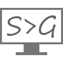

	<b>Unofficial PortableApps Repository</b>
	

	

	<a href="https://github.com/xmha97/PortableApps/releases/tag/ImageGlass-v2.21"><b>ImageGlass Portable</b></a>
	 
	
	
	

	

	<a href="https://github.com/xmha97/PortableApps/releases/tag/ScreenToGif-v2.21"><b>ScreenToGif Portable</b></a>
	 
	
	
	

	

	<a href="https://github.com/xmha97/PortableApps/releases/tag/Shadowsocks-v2.21"><b>Shadowsocks Portable</b></a>
	 
	
	
	

	

	<a href="https://github.com/xmha97/PortableApps/releases/tag/Simplenote-v2.21"><b>Simplenote Portable</b></a>
	 
	
	
	

	

	<a href="https://github.com/xmha97/PortableApps/releases/tag/TextGrab-v2.21"><b>TextGrab Portable</b></a>
	 
	
	
	

	

	<a href="https://github.com/xmha97/PortableApps/releases/tag/TickTick-v2.21"><b>TickTick Portable</b></a>
	 
	
	
	

	

	<a href="https://github.com/xmha97/PortableApps/releases/tag/TorBrowser-v2.21"><b>TorBrowser Portable</b></a>
	 
	
	
	

	

	<a href="https://github.com/xmha97/PortableApps/releases/tag/Trello-v2.21"><b>Trello Portable</b></a>
	 
	
	
	

	

	<a href="https://github.com/xmha97/PortableApps/releases/tag/RetroArch-v2.21"><b>RetroArch Portable</b></a>
	 
	
	

